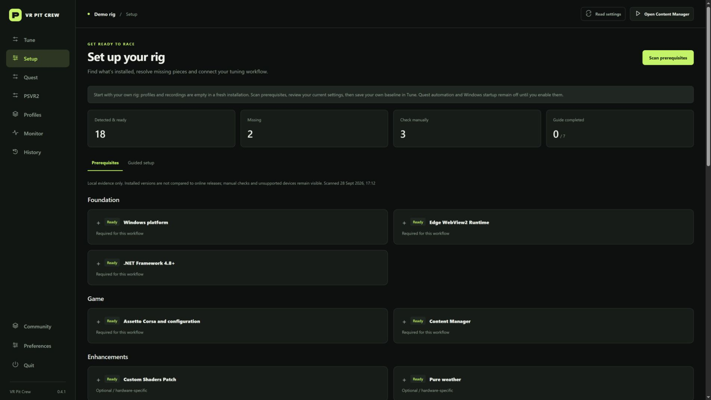
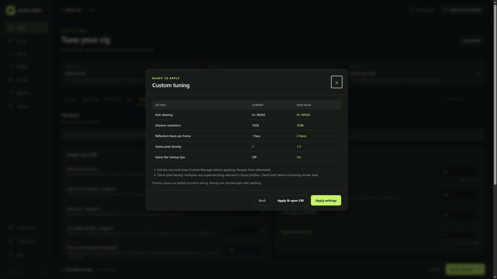
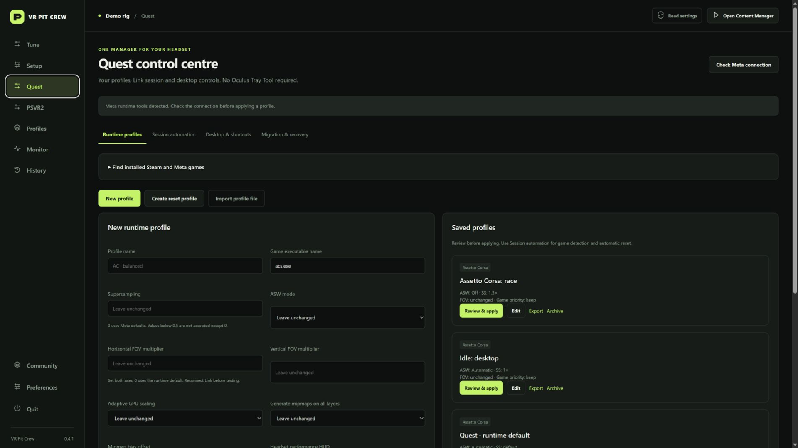
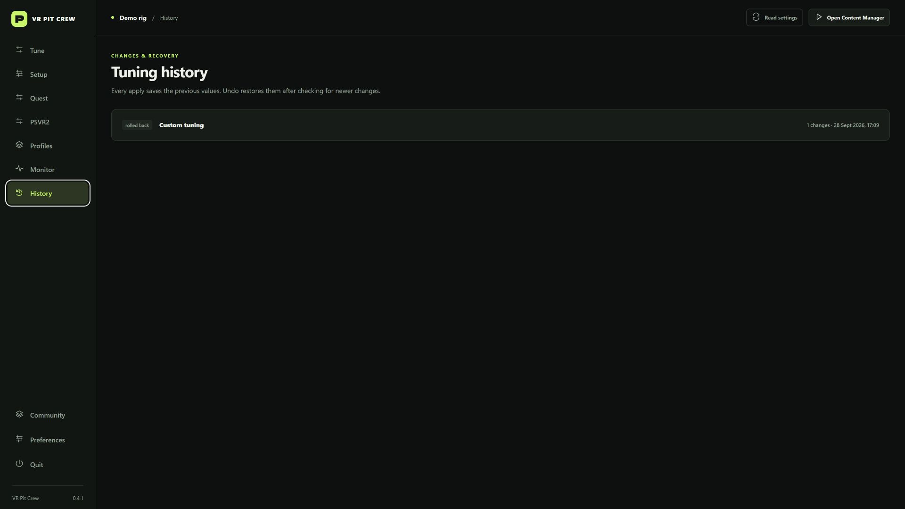
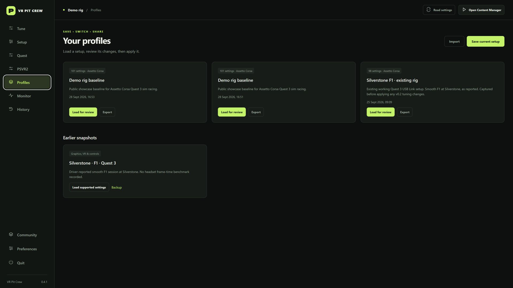

# VR Pit Crew

**Set up your rig. Save your settings. Get back on track.**

A free Windows companion for Assetto Corsa and Quest VR sim racing, by **Neil9Bailey**.

## Download

**Current build: 0.4.1 preview.**

**[Download the Windows installer — VR Pit Crew 0.4.1](https://github.com/neil9bailey/VR-Pit-Crew-Downloads/releases/download/v0.4.1/VR-Pit-Crew-0.4.1-Setup-x64.exe)**

[Portable ZIP](https://github.com/neil9bailey/VR-Pit-Crew-Downloads/releases/download/v0.4.1/VR-Pit-Crew-0.4.1-Windows-x64.zip) · [SHA256 checksums](https://github.com/neil9bailey/VR-Pit-Crew-Downloads/releases/download/v0.4.1/SHA256SUMS-0.4.1.txt) · [Release notes and assets](https://github.com/neil9bailey/VR-Pit-Crew-Downloads/releases/tag/v0.4.1) · [Installation guide](INSTALL.md) · [Discord community](https://discord.gg/8yVKdS2w9)

Run Setup, then open **VR Pit Crew** from the Start menu. Python is bundled: no coding tools or scripts are needed. Setup checks for Microsoft WebView2 Runtime and .NET Framework 4.8. Choose the Setup EXE or portable ZIP; GitHub's automatic “Source code” archives contain only this download site's documentation.

**Windows 10/11 x64. Unsigned preview.** Windows may display an unknown-publisher or reputation warning. Release assets include SHA256 checksums. Wider hardware testing is still in progress; check the release notes before use.

## Screenshots

More in [docs/screenshots](docs/screenshots/).

## Built for your next session

- Scan prerequisites and follow a guided integration setup.
- Review and apply supported controls for AC graphics, CSP, Quest Link, NVIDIA profiles, Windows power and selected services, plus AC wheel feedback and button bindings.
- Save reusable rig profiles, preview changes, keep backups and undo supported applied changes.
- Manage independent Quest runtime/session profiles, optional per-game automation, audio/power recovery and native tray controls.
- Monitor AC driving telemetry and application frame times, record sessions and export results.
- Choose your theme, accent colour and layout density.

The current focus is original Assetto Corsa, Quest USB Link and NVIDIA. Some features depend on the installed game, hardware and vendor tools. Headset refresh rate/render resolution, firmware, full wheel calibration and GPU clock/fan curves remain in their vendor applications. Actual Quest runtime changes still need headset HUD validation. Application FPS can represent the desktop mirror; it is not headset FPS. No automatic “more FPS” guarantee is made.

## Clean first installation

No developer profiles, personal settings, recorded sessions, telemetry exports,
backups or logs are bundled. Profiles and recordings start empty. Setup scans your
own rig; create and save your own profiles. Quest automation, Windows startup,
hotkeys and voice are off until enabled. Optional presets only stage suggestions
for review. Upgrades preserve each existing user's own data.

See [0.4.1 release notes](RELEASE-NOTES-0.4.1.md), [post-ready share links](SHARE-LINKS.md) and the
[Quest feature matrix](TRAY-TOOL-PARITY.md).

## First session

1. Open **Setup** and resolve the prerequisites for the features you want.
2. Save your current settings as a baseline profile.
3. Close the game and Content Manager before applying game configuration changes.
4. Review a small set of changes, apply them, then test a repeatable session.
5. Use History/Undo where supported. Leave Quest automation off until you have verified manual commands with the Meta performance HUD.

## Help and feedback

Join **[VR Pit Crew on Discord](https://discord.gg/8yVKdS2w9)** to share a rig setup, report an issue or suggest a feature. Include your app version, Windows version, GPU, headset/connection, sim and steps to reproduce. Remove personal paths and identifiers before sharing logs. Reports are not uploaded automatically.

## Support development

VR Pit Crew is **free to use**, with no paid feature locks. If it helps your racing, an optional contribution supports ongoing development:

**[Support Neil9Bailey on PayPal](https://paypal.me/neil9bailey)**

Contributions are optional and do not buy priority support, a licence upgrade or guaranteed future features. Payments are handled on PayPal; the app does not collect payment credentials.

## Downloads and licence

GitHub records downloads for each release asset. The badge above counts the v0.4.1 installer only, excluding the portable ZIP and checksum files. Repeat downloads also count; these are not unique users, installations or usage statistics. See [download statistics](DOWNLOADS.md).

This public repository contains release information and packaged downloads. Application source is maintained privately. Free executable use is covered by [LICENCE.txt](LICENCE.txt); third-party notices are included with the app. This is an independent community tool and is not affiliated with Meta, Kunos, NVIDIA, ASUS or third-party mod authors.

Read [Trust, safety and recovery](TRUST-AND-SAFETY.md) before applying settings.
